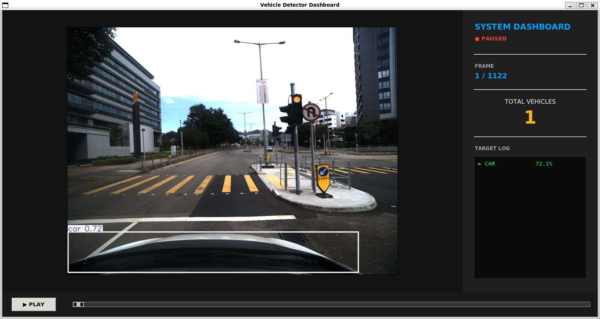

# AAE4011 Assignment 1 — Q3: ROS-Based Vehicle Detection from Rosbag

> **Student Name:** FUNG Tsan Wai | **Student ID:** 25120771D | **Date:** 15-3-2026

---

## 1. Overview

*This project implements a complete, real-time vehicle detection pipeline wrapped in a ROS Noetic package. It reads compressed image messages from a provided rosbag, processes them by deep learning object detection model, and displays the results of real-time statistics in Tkinter dashboard.*


## 2. Detection Method *(Q3.1 — 2 marks)*

*I chose the the **YOLOv8 Nano** model for the pipeline. It is because YOLOv8 Nano have a outstanding performance in high-speed inference and efficiency. Also, since the environment runs inside a WSL2 virtual machine, YOLOv8 is friendly for this situation which can be run easily. So it is suitable for this project which is real-time and resource-constrained applications*

## 3. Repository Structure
```
vehicle_detector_pkg/
│
├── CMakeLists.txt
├── package.xml
├── launch/
│   └── vehicle_detection.launch      # Launch file to start the ROS node
└── src/
    └── vehicle_detection.py          # Main Python script (extraction, YOLO, and UI)
```
## 4. Prerequisites

- OS: Ubuntu 20.04 (native or via WSL2)
- ROS: ROS 1 Noetic
- Python: Python 3.8+
- Core libraries:
  - rospy, rosbag
  - opencv-python (cv2)
  - numpy
  - Pillow (PIL)
  - ultralytics (YOLOv8)
  - tkinter, ttk

## 5. How to Run *(Q3.1 — 2 marks)*

Ensure that you have set up the ROS 1 Noetic environment with Ubuntu 20.04 and opened a terminal before following the steps. Type the command below step by step

1. Clone the repository
   ```
   cd ~/catkin_ws/src
   # copy or clone this repository here
   ```
2. Install dependencies
   ```
   sudo apt update
   sudo apt install python3-pip
   pip3 install ultralytics pillow numpy opencv-python
   ```
3. Build the workspace
   ```
   cd ~/catkin_ws
   catkin_make
   source devel/setup.bash
   ```
4. Place the rosbag file
   Open src/vehicle_detection.py and update the bag_path variable to match your local absolute path:
   ```
   bag_path = '/path/to/your/downloaded/Ros.bag'
   ```
5. Launch the pipeline
   ```
   cd ~/catkin_ws
   source devel/setup.bash
   roslaunch vehicle_detector_pkg vehicle_detection.launch
   ```
## 6. Sample Results

- Image extraction summary
  - Total frames: 1122
  - Resolution: 2200 x 1740
  - Topic name: `/hikcamera/image_1/compressed`

- Detection results screenshot:
  
  

## 7. Video Demonstration *(Q3.2 — 5 marks)*

**Video Link:** https://youtu.be/SwM3xvqDMK0

## 8. Reflection & Critical Analysis *(Q3.3 — 8 marks, 300–500 words)*

### (a) What Did You Learn? *(2 marks)*

*Identify at least two specific technical skills or concepts you gained.*

### (b) How Did You Use AI Tools? *(2 marks)*

*Describe how you used AI assistants. Discuss both benefits and limitations. If you did not use any, explain your alternative approach.*

### (c) How to Improve Accuracy? *(2 marks)*

*Propose two concrete strategies to improve detection accuracy and explain why each would help.*

### (d) Real-World Challenges *(2 marks)*

*Discuss two challenges of deploying this pipeline on an actual drone in real time.*

## 9. References

*List any references, libraries, or datasets used.*
